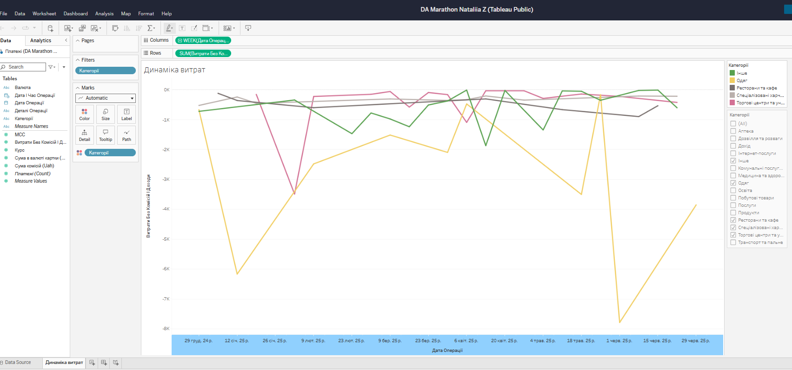

## Financial Expense Dashboard — Power BI

A dashboard built from a personal income/expense dataset, covering data cleaning, DAX measures, and interactive visualizations.

**Tasks:**
- Clean and prepare income/expense dataset
- Build a DAX measure for commission percentage using DIVIDE and ABS
- Create a line chart showing expense trends over time
- Build a horizontal bar chart with category filtering and custom colors
- Build a histogram of expense distribution using data binning
- Assemble a single dashboard page combining all visuals
- Enable cross-visual filtering (click-to-filter interactivity)
- Publish to Power BI Service

**Dashboard link:** [My Power BI Dashboard](https://app.powerbi.com/groups/me/reports/e985c98b-3d3c-41cf-ba71-f5005d1f2970/bf636df333e1006d8f66?experience=power-bi)

---

## About this project
This repo demonstrates:
- basic data cleaning
- spreadsheet analytics
- visualization in Power BI
- structured project documentation

